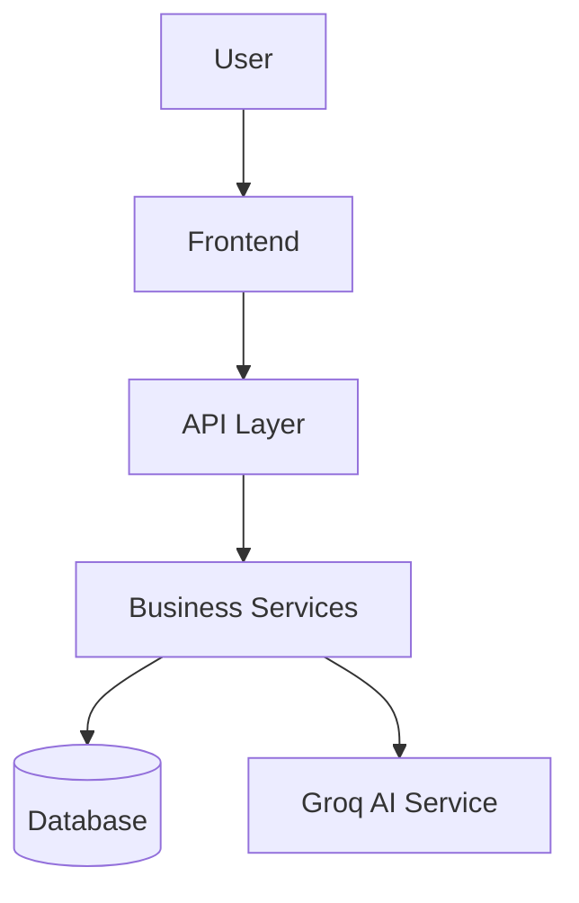

# ClubOps AI

## Overview

ClubOps AI is an AI-powered operational platform for college clubs that centralizes clubs, volunteers, memberships, events, tasks, meetings, action items, documents, risks, and announcements. 

The AI layer is designed to understand application context and perform controlled application actions where implemented, rather than simply generating text.

## Problem

College clubs often rely on fragmented workflows involving WhatsApp, spreadsheets, documents, meeting notes, and personal task lists. This scattered communication leads to:
- Unclear ownership
- Missed deadlines
- Fragmented knowledge
- Volunteer coordination problems
- Task assignment problems
- Delayed risk detection
- Repeated mistakes between event cycles

## Solution

ClubOps AI centralizes event operations with features including:
- **Club Management**: Centralized hub for club operations.
- **Volunteer & Membership Management**: Join requests, skill profiles, and approval workflows.
- **Event Management**: Create and manage events and milestones.
- **Task Management**: Create tasks, set priorities, track dependencies, and update status.
- **AI Task Suggestion**: Groq-powered AI breaks down event goals into actionable tasks.
- **Knowledge Repository (RAG)**: Document chunking and semantic-like search (naive keyword search currently implemented) to synthesize answers based on club history.
- **Risk Detection**: Monitor tasks and dependencies for potential risks.

## User Roles

ClubOps AI implements Context-Derived Roles scoped to clubs:
- **President**: Creates clubs, transfers Club Head, views high-level governance and risk overview.
- **Club Head**: Manages club operations, creates events, reviews AI staffing and volunteer assignment proposals, reviews meeting action items, publishes announcements.
- **Volunteer**: Discovers clubs, submits join requests, declares skills & availability, views assigned tasks, updates task progress.

## Core Workflow

President
→ Create Club
→ Assign Club Head
→ Volunteer Registration
→ Join Request
→ Club Head Approval
→ Event Creation
→ Task Management
→ AI Assistance (Task Breakdown)
→ Event Execution
→ Risk Monitoring
→ Knowledge Preservation

## Innovation

- **Club-specific operational context**: Actions and roles are scoped to the specific club.
- **AI-assisted workflows**: Groq LLM helps break down event goals into actionable tasks.
- **Institutional knowledge**: Documents are ingested and can be queried to synthesize answers from historical records.
- **Controlled AI actions**: AI recommends tasks, but deterministic rules and human review govern their creation and assignment.

## AI Architecture

- **AI Provider**: Groq
- **Capabilities**: Structured JSON output for task breakdown and generation, RAG answer synthesis.
- **Validation**: AI outputs (like task priorities) are validated against defined schemas before use.
- **RAG**: Document ingestion chunks texts, and a keyword-based search retrieves relevant contexts for the AI to synthesize answers.

## System Architecture



## Database

Implemented entities: User, Club, ClubMembership, JoinRequest, Skill, VolunteerSkill, VolunteerProfile, Event, EventMember, Availability, Task, TaskAssignment, Meeting, ActionItem, Document, DocumentChunk, Risk, Announcement, Notification, AuditLog.

## Security

Please see the [Security Model](docs/security.md) for detailed information on the Deny-by-default RBAC, JWT foundation, API defense, and audit controls.

## Tech Stack

- **Frontend**: React 19, Vite, Tailwind CSS v4, React Router v7
- **Backend**: FastAPI, Pydantic, SQLAlchemy, Alembic
- **Database**: PostgreSQL (or SQLite for development)
- **Authentication**: JWT (python-jose, bcrypt)
- **AI**: Groq

## Installation

### Backend
```bash
cd backend
python -m venv venv
source venv/bin/activate
pip install -r requirements.txt
cp .env.example .env
# Edit .env with your GROQ_API_KEY and other credentials
alembic upgrade head
uvicorn app.main:app --reload
```

### Frontend
```bash
cd frontend
npm install
npm run dev
```

## Environment Variables

- `PROJECT_NAME`
- `ENVIRONMENT`
- `DEBUG`
- `API_V1_STR`
- `HOST`
- `PORT`
- `JWT_SECRET`
- `JWT_ALGORITHM`
- `ACCESS_TOKEN_EXPIRE_MINUTES`
- `DATABASE_URL`
- `GROQ_API_KEY`
- `GROQ_MODEL`
- `BREVO_API_KEY`
- `EMAIL_FROM`
- `EMAIL_FROM_NAME`
- `BACKEND_CORS_ORIGINS`

## Current Status

### Implemented
- Authentication and RBAC (Club-scoped roles)
- Club Management & Membership
- Event and Task Management
- AI Task Suggestion via Groq
- Document Ingestion and Chunking
- Keyword-based RAG Search & AI Synthesis
- Database Models and Migrations

### In Progress
- Vector Database Integration (Currently uses naive text search for RAG)
- Full Meeting-to-Action Item Extraction (Meeting entities exist, full AI extraction integration pending)

### Planned
- AI automated risk detection scanning
- Full skill-aware and availability-aware AI Task Assignment

## Documentation Index

- [Architecture Design](docs/architecture.md): High-level system structure, components, data flows, and tech stack.
- [Security Model](docs/security.md): Deny-by-default RBAC, JWT foundation, API defense, and audit controls.
- [Workflows](docs/workflows.md): State transitions from event initiation through RAG archiving.
- [API Contracts](docs/api-contracts.md): REST endpoints, request/response formats, and status codes.
- [Data Model](docs/data-model.md): PostgreSQL entities, ER diagrams, relationships, and indices.
- [LLM Research & Evaluation](docs/llm-research.md): Groq model selection, latency considerations, and prompting strategy.
- [AI Rules & Guardrails](docs/ai-rules.md): Architectural separation between AI recommendations and execution engines.