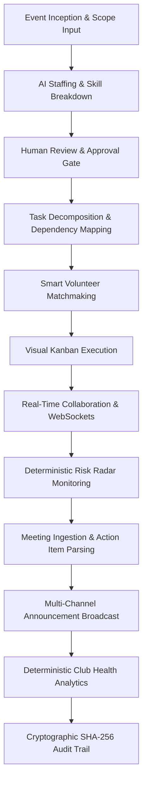
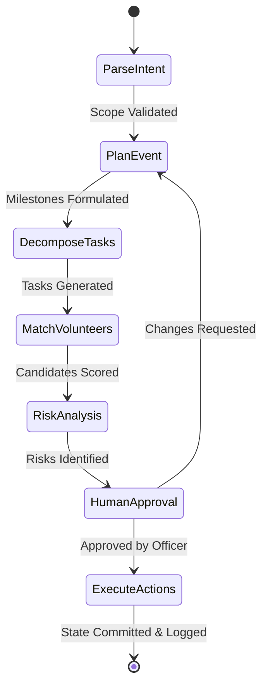

# Workflows, State Machines & LangGraph Orchestration

ClubOps AI coordinates multi-step operational workflows using structured state machines, LangGraph orchestration, deterministic constraint engines, and mandatory human review gates.

---

## 1. Master Operational Lifecycle

The operational lifecycle connects campus intent to cryptographic audit verification:



---

## 2. LangGraph Agent Workflow Architecture

The AI layer executes within a controlled LangGraph workflow pipeline defined by explicit state transitions and schema validation:



### Workflow Nodes & Responsibilities
1. **`parse_intent`**: Normalizes raw user prompts or unstructured meeting transcripts into structured operational objectives.
2. **`plan_event`**: Calculates event scale, duration, and minimum volunteer quotas.
3. **`decompose_tasks`**: Deconstructs high-level goals into 4–6 actionable tasks with dependency relationships and deadlines.
4. **`match_volunteers`**: Evaluates active club roster for skill compatibility and availability without scheduling conflicts.
5. **`risk_analysis`**: Deterministically checks for dependency bottlenecks, timeline tightness, and understaffed roles.
6. **`human_approval`**: Halts automatic execution; presents proposals to the Officer for review, modification, or rejection.
7. **`execute_actions`**: Invokes allowlisted backend tools (`create_task`, `assign_volunteer`, `dispatch_notification`) inside an atomic database transaction.

---

## 3. Visual Task Progression & Kanban State Machine

```
+------------+       Start Work       +-----------------+
|    TODO    | ---------------------> |   IN_PROGRESS   |
+------------+                        +-----------------+
      |                                        |
      | Blocked by Dep / Risk                  | Deliverable Completed
      v                                        v
+------------+                        +-----------------+
|  BLOCKED   | <--------------------- |      DONE       |
+------------+   Dependency Re-opened +-----------------+
```

- **TODO**: Task initialized with assigned volunteer, priority, and due date.
- **IN_PROGRESS**: Volunteer actively working. Workload counters update in real time.
- **BLOCKED**: Task has incomplete upstream prerequisites or active critical risks. Status patches prevent premature completion.
- **DONE**: Deliverables verified. Automatically unblocks downstream dependent tasks.

---

## 4. Multi-Channel Announcement Lifecycle

```
[ Officer Drafts Topic & Audience ]
              ↓
[ AI Draft Generation Engine ]
  - Formats content for target channel (Email / In-App / WhatsApp)
  - Generates clear Call-to-Action (CTA) and subject line
              ↓
[ Draft Stored (Status: DRAFT) ]
              ↓
[ Officer Review & Edits ]
              ↓
[ Officer Invokes /publish ]
              ↓
[ Multi-Channel Dispatch ]
  ├── Brevo API: Transactional Email Broadcast
  ├── Database: In-App Notification Records Created
  └── WebSocket Gateway: Real-Time Event Ticker Ping
              ↓
[ Status Transitions to PUBLISHED ]
```

---

## 5. Meeting Transcript Ingestion & Action Item Parsing

1. **Transcript Ingestion**: Officer pastes unstructured meeting minutes or speech-to-text transcripts.
2. **AI Action Extraction**: Groq LLM extracts action items with suggested owner, deadline, and confidence score.
3. **Review & Validation**: Officer reviews extracted items.
4. **Task Conversion**: Approved action items are batch-converted into formal Kanban tasks with single-click conversion.

---

## 6. Cryptographic Audit Chain Lifecycle

Every state mutation follows an immutable commit sequence:
1. State mutation requested by authenticated actor.
2. Security layer validates RBAC permissions.
3. Mutation executes within an atomic database transaction.
4. `AuditService` retrieves latest sequential block (`prev_hash`).
5. Computes `integrity_hash = SHA-256(prev_hash + ... + canonical_diff)`.
6. Commits `AuditLog` row alongside state mutation.

---

## 7. FAISS Vector Database & RAG Search Workflow

```
[ Institutional Document Upload (SOP / Policy / Guide) ]
                      ↓
[ Sliding-Window Chunking (400 chars, 80-char stride) ]
                      ↓
[ 384-Dim Dense Vector Embedding Generation (L2 Normalized) ]
                      ↓
[ Persistent FAISS Indexing (faiss.IndexFlatIP + metadata.json) ]
                      ↓
[ Search Query Issued: "How to reserve auditorium?" ]
                      ↓
[ Query Dense Vector Computation & FAISS Nearest Neighbor Search ]
                      ↓
[ Top-K Cosine Similarity Filter & Confidence Scoring (%)]
                      ↓
[ Groq Context Injection & Grounded Answer Synthesis with Exact Citations ]
```

